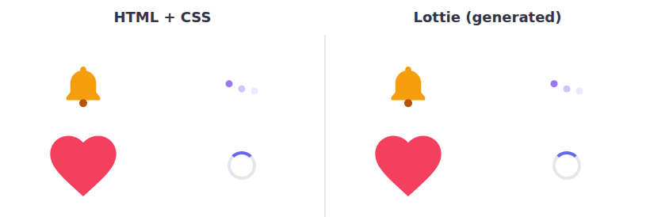

# css2lottie

**Write animations in HTML + CSS, get a Lottie file. No After Effects needed.**

[](https://github.com/99proteam/css2lottie/actions/workflows/ci.yml)
[](https://www.npmjs.com/package/css2lottie)
[](LICENSE)
[](https://github.com/sponsors/99proteam)

css2lottie converts CSS `@keyframes`, transitions and inline SVG into [Lottie](https://airbnb.io/lottie/) JSON (Bodymovin 5.7+). The output plays in lottie-web, lottie-ios, lottie-android and Flutter.

<!-- Recorded from examples/: left = Chromium rendering the CSS, right = lottie-web playing the generated JSON. -->
<p align="center">
  
</p>

```bash
npx css2lottie spinner.html -o spinner.json
```

- **Runs locally.** There's no server, no account and no upload. A headless Chromium on your machine reads the animation.
- **Matches the browser's frames.** Values are read from the browser's own animation engine via the Web Animations API, frame by frame. The test suite compares a CSS screenshot with a lottie-web screenshot of every example.
- **Keeps real easing.** When a CSS timing function (`ease`, `ease-in-out`, `cubic-bezier(...)`) can be reproduced exactly, you get one Lottie keyframe with matching bezier handles instead of 60 keyframes per second. It falls back to per-frame sampling only where needed.
- **Tells you what it dropped.** A report lists every unsupported or approximated feature, such as `box-shadow`, filters or gradients.

## Install

```bash
npm install --save-dev css2lottie
npx css2lottie install-browser   # one-time: downloads the headless Chromium used for sampling
```

Requires Node.js 18.17+. If you already have Chrome/Chromium, you can skip `install-browser` and pass `--executable-path` (or set `CSS2LOTTIE_CHROMIUM_PATH`).

## CLI

```bash
npx css2lottie input.html -o output.json --width 400 --height 400 --fps 60
```

| Flag                       | Description                                                                           |
| -------------------------- | ------------------------------------------------------------------------------------- |
| `-o, --output <file>`      | Output file (default `<input>.json`, `-` for stdout)                                  |
| `--width`, `--height`      | Composition size in px (default: the root element's size with `--selector`, else 512) |
| `--fps <n>`                | Frame rate (default 60)                                                               |
| `-d, --duration <ms\|s>`   | Duration (default: auto-detected from the longest animation; one loop for `infinite`) |
| `-s, --selector <css>`     | Convert only this root element (centered in the composition)                          |
| `--report`                 | Print unsupported / approximated features                                             |
| `--report-json <file>`     | Write the report as JSON                                                              |
| `--preview`                | Open a local page that plays the CSS original and the Lottie side by side             |
| `--no-optimize`            | Disable easing optimization (per-frame keys, simplified)                              |
| `--font <family=file>`     | Font file used to convert text to outlines (repeatable)                               |
| `--background`             | Include the page background color as a layer                                          |
| `--pretty`                 | Pretty-print the JSON                                                                 |
| `--executable-path <path>` | Chromium/Chrome binary to use                                                         |

`--preview` starts a small local server and opens a comparison page. It has a shared scrubber, so you can step both versions to the same frame.

## API

```ts
import { convert } from "css2lottie";

const lottie = await convert({ html, width: 400, height: 400, fps: 60 });
```

To get the report as well:

```ts
import { convertWithReport, formatReport } from "css2lottie";

const { lottie, report } = await convertWithReport({
  file: "./animations/logo.html", // or `html` (string) / `url`
  selector: "#logo", // optional: one root element
  duration: 2000, // optional: ms (auto-detected by default)
  fonts: { Inter: "./fonts/Inter-Bold.ttf" }, // optional: text → outlines
});

console.log(formatReport(report));
```

| Option                  | Default               | Description                                                         |
| ----------------------- | --------------------- | ------------------------------------------------------------------- |
| `html` / `file` / `url` | —                     | Source document (one is required)                                   |
| `baseUrl`               | —                     | Resolves relative URLs when passing an `html` string                |
| `width`, `height`       | root size or 512      | Composition size                                                    |
| `fps`                   | `60`                  | Frame rate                                                          |
| `duration`              | auto                  | Duration in ms                                                      |
| `selector`              | `body`                | Root element to convert                                             |
| `optimizeKeyframes`     | `true`                | Emit bezier-eased keyframes when they reproduce the samples exactly |
| `fonts`                 | `{}`                  | `family → file` map for text outlines                               |
| `background`            | `false`               | Add the page background as a layer                                  |
| `browser`               | launched per call     | Reuse a Playwright `Browser` for batch conversions                  |
| `executablePath`        | Playwright's Chromium | Custom Chromium/Chrome binary                                       |

Batch conversions can reuse one browser:

```ts
import { convert, launchBrowser } from "css2lottie";

const browser = await launchBrowser();
for (const file of files) await convert({ file, browser });
await browser.close();
```

## Supported features (v1)

| CSS / SVG                                                                                   | Lottie output                                                         | Notes                                                                       |
| ------------------------------------------------------------------------------------------- | --------------------------------------------------------------------- | --------------------------------------------------------------------------- |
| `transform` (translate, rotate, scale, skew, matrix), `translate` / `rotate` / `scale`      | Layer position / rotation / scale / skew, anchor = `transform-origin` | 3D transforms are flattened to 2D, and `backface-visibility` is respected   |
| `opacity`, `visibility`                                                                     | Layer opacity                                                         | Multiplied down the tree (Lottie parents don't pass opacity on)             |
| `background-color`                                                                          | Fill                                                                  |                                                                             |
| `border` (width, color per side)                                                            | Stroke, trimmed strokes (circles), or trapezoid fills                 | Rounded boxes with different sides are approximated                         |
| `border-radius`                                                                             | Rect roundness, ellipse, or a per-corner path                         | Elliptical and per-corner radii supported                                   |
| `width` / `height` / layout (`left`, `top`, `margin`, …)                                    | Rect size + layer position                                            |                                                                             |
| SVG `<rect>`, `<circle>`, `<ellipse>`, `<path>`, `<polygon>`, `<polyline>`, `<line>`, `<g>` | Shape layers with bezier paths, parented to the `<svg>` viewBox       | Arcs, quadratics and relative commands are converted to cubics              |
| SVG `fill`, `stroke`, `stroke-width`, `*-opacity`, `stroke-linecap/join`, `fill-rule`       | Fill / stroke                                                         |                                                                             |
| `d: path(...)` animation                                                                    | Animated path                                                         | Needs the same number of points on every frame                              |
| Nested elements                                                                             | Layer parenting                                                       |                                                                             |
| `::before` / `::after`                                                                      | Shape layers                                                          | Need to be absolutely positioned in a positioned host                       |
| ``                                                                                     | Image layer + base64 asset                                            |                                                                             |
| Text                                                                                        | Glyph outlines (shapes)                                               | Needs a TTF/OTF/WOFF font file via `@font-face` or `fonts`                  |
| `@keyframes`, transitions triggered on load, `element.animate()`                            | Keyframes                                                             | delay, iteration-count, direction, fill-mode and playback rate              |
| `ease`, `ease-in`, `ease-out`, `ease-in-out`, `cubic-bezier()`, `linear`                    | Bezier keyframe easing                                                | `steps()` and `linear(...)` stops are sampled per frame                     |
| `animation-iteration-count: infinite`                                                       | A seamless loop                                                       | The duration is the LCM of the loop periods, starting from the steady state |

## Limitations

Some CSS has no Lottie equivalent yet. These features are ignored or approximated, and each one is listed in the report:

- `box-shadow`, `filter`, `backdrop-filter`, `mix-blend-mode`, `text-shadow`
- `linear-gradient` / `radial-gradient` and background images; SVG gradients and patterns
- `clip-path`, masks, and `overflow: hidden` clipping
- `stroke-dasharray` / `stroke-dashoffset`, so the "path drawing" effect doesn't carry over
- `perspective`: 3D is flattened to 2D
- Text stays as outlines, not editable text layers. System fonts with no accessible file are skipped.
- Animations driven by JavaScript (`requestAnimationFrame`, timers, scroll) and transitions triggered later than page load
- Group opacity is approximated per layer, so overlapping children of a semi-transparent parent blend slightly differently

See [ROADMAP.md](ROADMAP.md) for what's next. If the converter gets something wrong, please [open an "Unsupported animation" issue](https://github.com/99proteam/css2lottie/issues/new?template=unsupported-animation.yml) and attach your HTML.

## How it works

1. The page loads in headless Chromium via Playwright, and css2lottie waits for fonts and images.
2. All animations from `document.getAnimations()` (CSS animations, transitions and Web Animations) are paused. Their timing and keyframes are recorded.
3. For every frame, and on both sides of every keyframe boundary, each animation is seeked with `animation.currentTime`. The sampler records computed styles, the composed transform matrix, `transform-origin` and the untransformed layout box.
4. Each element becomes a Lottie layer. Converters in [`src/converters/`](src/converters) map property families to Lottie data.
5. For each channel, the keyframe optimizer tries the CSS timing function of the segment, or the matching part of it, as one bezier keyframe. It keeps that keyframe only if it reproduces every sampled frame within tolerance. Otherwise it keeps per-frame keys simplified with Ramer–Douglas–Peucker.

## Examples

[`examples/`](examples) contains 11 animations: spinner, bouncing ball, pulse, logo reveal, loading dots, checkmark, card flip, progress bar, heart beat, notification bell and text wave. Regenerate their Lottie files with `npm run build && npm run examples`. The test suite converts each one, validates it against the [Lottie JSON schema](https://lottie.github.io/lottie-spec/), checks it against a snapshot and compares lottie-web renders with the CSS renders.

## Support this project

css2lottie is free, MIT-licensed and maintained in spare time. If it saves you an After Effects license or a designer round-trip, please consider [sponsoring on GitHub](https://github.com/sponsors/99proteam):

| Tier                  | Per month | You get                                                           |
| --------------------- | --------- | ----------------------------------------------------------------- |
| ☕ **Individual**     | $5        | Your name in the backers list below, plus our thanks              |
| 💜 **Supporter**      | $25       | Name + link in the README, and a vote on roadmap priorities       |
| 🏢 **Company**        | $100      | **Your company logo in this README**, with a link                 |
| 🚀 **Company — Gold** | $500      | Large logo at the top of the README + priority on issues you file |

<!-- sponsors -->

_Your logo here — [become a sponsor](https://github.com/sponsors/99proteam)._

<!-- /sponsors -->

## Contributing

PRs are welcome. [CONTRIBUTING.md](CONTRIBUTING.md) explains how to add support for a new CSS property; each converter is one small file with a test.

## License

[MIT](LICENSE). Example font: Instrument Sans (SIL Open Font License, see `examples/fonts/`).
